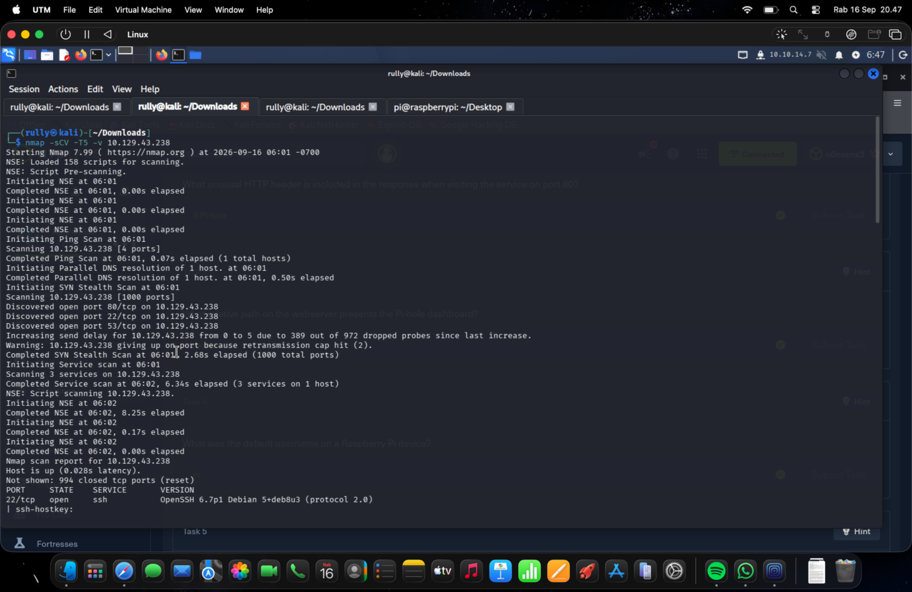
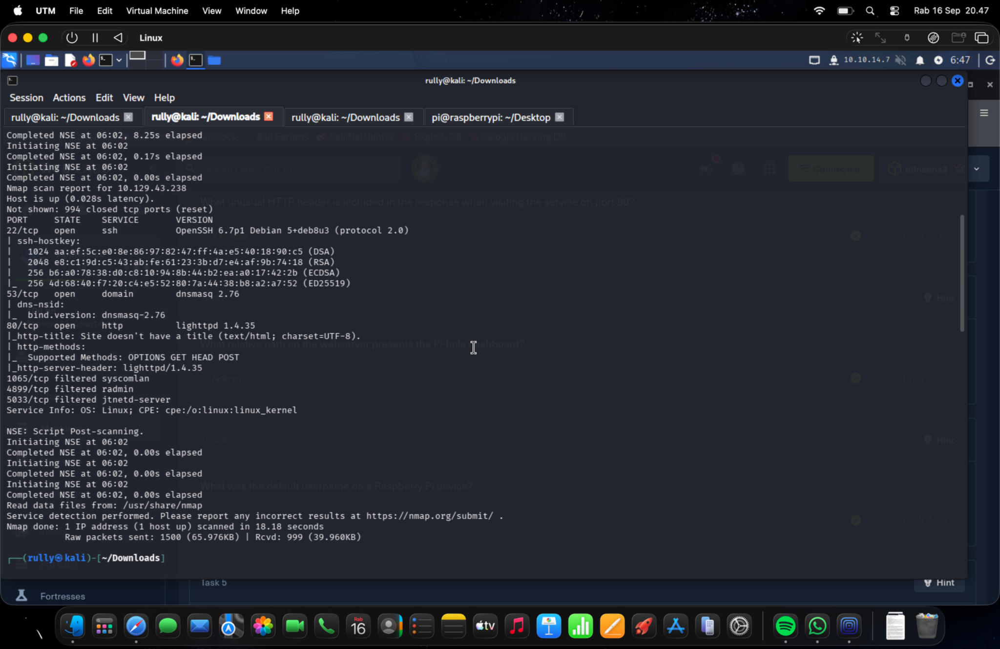
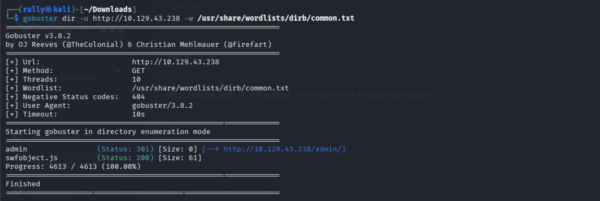
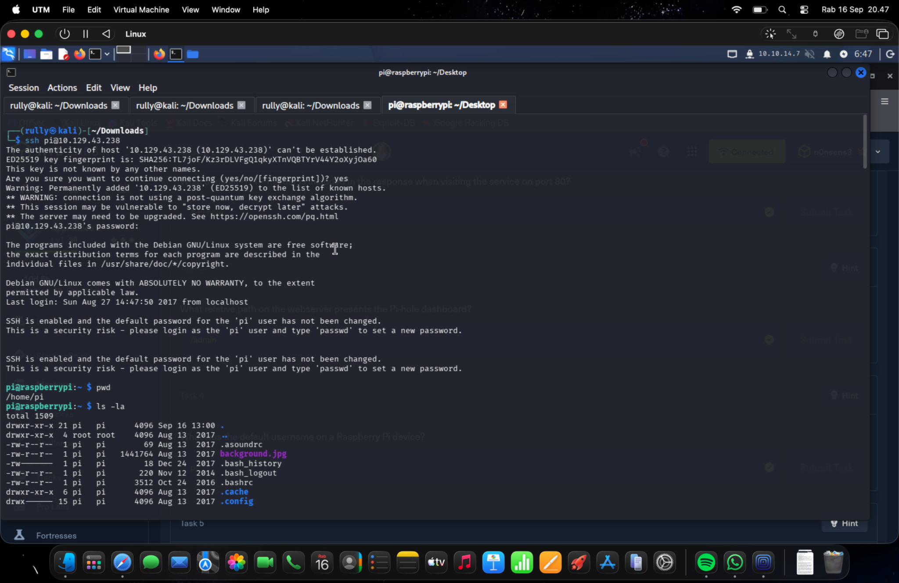
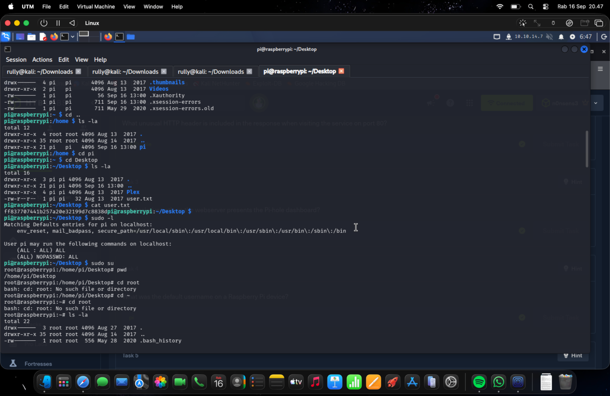
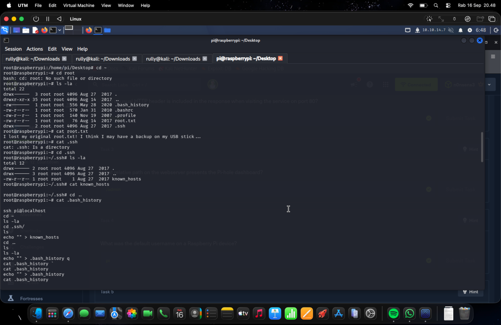
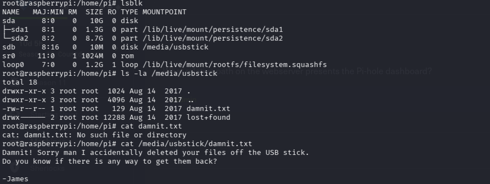
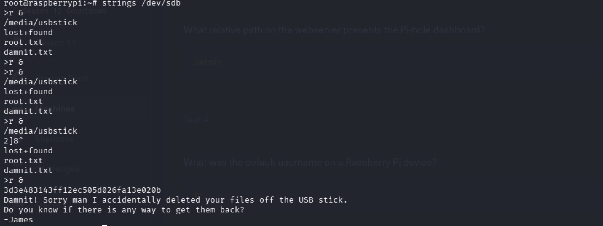

# Hack The Box — Mirai CTF Writeup

**Author:** Rully Miftahur Rozaq  
**Platform:** Hack The Box  
**Machine:** Mirai  
**Operating System:** Linux / Raspberry Pi  
**Difficulty:** Easy  
**Completion Date:** September 16, 2026

## 1. Summary

This writeup documents the compromise of the Hack The Box **Mirai** machine. Initial reconnaissance exposed SSH, DNS, and HTTP services. Web enumeration identified a Pi-hole administration path, while the SSH banner revealed that the default Raspberry Pi password had not been changed. The unchanged default credentials provided an initial shell as the `pi` user.

Local enumeration showed that `pi` could execute any command through `sudo` without supplying a password, allowing immediate privilege escalation to `root`. The root flag was not stored normally: a note indicated that the original flag had been deleted from a USB device. Reading printable data directly from the raw USB block device recovered the deleted flag.

## 2. Scope and Authorization

All testing was performed against a Hack The Box machine inside an authorized and isolated CTF environment. The commands and techniques in this report must only be used against systems for which explicit authorization has been granted.

## 3. Testing Environment

| Item | Details |
| --- | --- |
| Attacker system | Kali Linux running in UTM |
| Target address | `10.129.43.238` |
| Target hostname | `raspberrypi` |
| Target platform | Debian-based Raspberry Pi system |
| Tools | Nmap, Gobuster, OpenSSH, standard Linux utilities |
| Important services | SSH, DNS, HTTP |

> The target IP is a temporary lab address and may be different when the machine is restarted.

## 4. Attack Path

| Stage | Finding | Result |
| --- | --- | --- |
| Reconnaissance | Ports 22, 53, and 80 were open | Exposed SSH, DNS, and web services identified |
| Web enumeration | `/admin/` returned HTTP 301 | Pi-hole administration path discovered |
| Initial access | Raspberry Pi default credentials were unchanged | SSH shell obtained as `pi` |
| Privilege escalation | `(ALL) NOPASSWD: ALL` in sudo permissions | Root shell obtained with `sudo su` |
| Flag recovery | USB device mounted from `/dev/sdb` | Deleted root flag recovered with `strings` |

## 5. Reconnaissance and Enumeration

### 5.1 Service Discovery with Nmap

I began by scanning the target to identify reachable services and their versions:

```bash
nmap -sCV -T5 -v 10.129.43.238
```

The relevant options were:

- `-sC` — runs Nmap's default NSE scripts.
- `-sV` — detects service and application versions.
- `-T5` — uses very aggressive timing, which is acceptable in this controlled lab but may reduce reliability on unstable networks.
- `-v` — displays verbose progress information.



*Figure 1 — Initial Nmap service and version scan against the target.*

The completed scan identified three open TCP ports:

| Port | Service | Version / Observation |
| ---: | --- | --- |
| 22/tcp | SSH | OpenSSH 6.7p1 Debian 5+deb8u3 |
| 53/tcp | DNS | dnsmasq 2.76 |
| 80/tcp | HTTP | lighttpd 1.4.35 |

Ports 1065, 4899, and 5033 appeared as filtered. The open web service and the Raspberry Pi-oriented service combination justified further HTTP enumeration.



*Figure 2 — Nmap results showing SSH, DNS, and HTTP services.*

### 5.2 Web Directory Enumeration

I enumerated common paths on the HTTP service with Gobuster:

```bash
gobuster dir -u http://10.129.43.238 \
  -w /usr/share/wordlists/dirb/common.txt
```

Gobuster returned the following useful results:

```text
/admin          Status: 301
/swfobject.js   Status: 200
```

The `/admin/` redirect identified the administration path used by the Pi-hole interface. Although the web service was useful for identifying the target, the subsequent SSH banner exposed a simpler initial-access path.



*Figure 3 — Gobuster discovered the `/admin/` path and `swfobject.js`.*

## 6. Initial Access

### 6.1 SSH Login as the Raspberry Pi User

The standard Raspberry Pi username is `pi`. I attempted to connect through the exposed SSH service:

```bash
ssh pi@10.129.43.238
```

The login succeeded using the unchanged default Raspberry Pi credentials. After authentication, the system displayed the following warning:

```text
SSH is enabled and the default password for the 'pi' user has not been changed.
This is a security risk.
```

This warning confirmed the root cause of the initial compromise: a network-accessible administrative account still used its factory-default password.

I verified the current working directory and enumerated the user's home directory:

```bash
pwd
ls -la
```

The resulting prompt and `/home/pi` path confirmed interactive access as the `pi` user.



*Figure 4 — SSH access obtained as `pi`; the login banner confirms the unchanged default password.*

### 6.2 User Flag

I navigated to the user's Desktop and found `user.txt`:

```bash
cd /home/pi/Desktop
ls -la
cat user.txt
```

The command returned a 32-character user flag, confirming successful user-level compromise. The flag value is intentionally omitted from the report text.

## 7. Privilege Escalation

### 7.1 Sudo Permission Enumeration

I checked the commands that the `pi` account could run through `sudo`:

```bash
sudo -l
```

The relevant result was:

```text
(ALL) NOPASSWD: ALL
```

This rule allowed `pi` to execute any command as any user without entering a password. I therefore started a root shell:

```bash
sudo su
```

The prompt changed from `pi@raspberrypi` to `root@raspberrypi`, confirming successful privilege escalation.



*Figure 5 — User flag discovery, unrestricted passwordless sudo access, and the resulting root shell.*

## 8. Root Flag Investigation

### 8.1 Root Directory Hint

After entering the root account's home directory, I listed its contents and read `root.txt`:

```bash
cd ~
ls -la
cat root.txt
```

Instead of the flag, the file contained a clue:

```text
I lost my original root.txt! I think I may have a backup on my USB stick...
```

This indicated that the actual root flag was associated with removable storage. A brief inspection of `.ssh` and `.bash_history` did not produce the flag, so the next step was to enumerate mounted block devices.



*Figure 6 — `root.txt` states that the original flag may have been backed up to a USB stick.*

### 8.2 USB Device Enumeration

I listed available block devices:

```bash
lsblk
```

The output showed a 10 MB device mounted at `/media/usbstick`:

```text
sdb   8:16   0   10M   0 disk   /media/usbstick
```

I then inspected the mount point:

```bash
ls -la /media/usbstick
cat /media/usbstick/damnit.txt
```

The note explained that files had accidentally been deleted from the USB stick:

```text
Damnit! Sorry man I accidentally deleted your files off the USB stick.
Do you know if there is any way to get them back?

-James
```



*Figure 7 — `/dev/sdb` is mounted at `/media/usbstick`; `damnit.txt` confirms that files were deleted.*

### 8.3 Recovering the Deleted Root Flag

Deleting a file normally removes its filesystem reference but may leave its data in unallocated space until that space is overwritten. Because the flag was stored as plaintext and the USB image was small, I searched printable strings directly from the raw block device:

```bash
strings /dev/sdb
```

The output contained a 32-character hexadecimal value associated with the deleted `root.txt`. This recovered value was accepted as the root flag. The exact flag is omitted from the report text.



*Figure 8 — The deleted root flag was recovered by extracting printable strings from `/dev/sdb`.*

## 9. Troubleshooting

### 9.1 `cd root`: No Such File or Directory

After running `cd ~` as root, the shell was already located in `/root`. Running:

```bash
cd root
```

attempted to access the relative path `/root/root`, which did not exist. The correct commands were either:

```bash
cd /root
```

or simply:

```bash
cd ~
```

### 9.2 `cat .ssh`: Is a Directory

The `.ssh` entry was a directory rather than a regular file. Its contents had to be listed or entered first:

```bash
ls -la .ssh
cd .ssh
```

### 9.3 `cat damnit.txt`: No Such File or Directory

The first attempt to read `damnit.txt` was made while the current directory was `/home/pi`:

```bash
cat damnit.txt
```

The file actually existed under `/media/usbstick`. Using its absolute path corrected the problem:

```bash
cat /media/usbstick/damnit.txt
```

This demonstrates that `ls /some/path` displays another directory's contents without changing the shell's current working directory.

## 10. Security Findings and Mitigations

### 10.1 Unchanged Default SSH Credentials — Critical

The `pi` account retained the default Raspberry Pi password while SSH was exposed. An attacker who knew the standard credentials could obtain an interactive shell without exploiting a software vulnerability.

**Recommended mitigation:** Change all default passwords during deployment, disable unused default accounts, prefer key-based SSH authentication, and restrict SSH with firewall rules.

### 10.2 Unrestricted Passwordless Sudo — Critical

The `pi` user could execute every command as root without authentication through `sudo`. Any compromise of the account therefore immediately became a complete system compromise.

**Recommended mitigation:** Apply least privilege, permit only specifically required commands, and avoid `NOPASSWD: ALL`.

### 10.3 Recoverable Deleted Data — Medium

The deleted flag remained recoverable from the raw USB device because the underlying data had not been overwritten.

**Recommended mitigation:** Use encryption for removable media and an appropriate secure-erasure process when sensitive data must be permanently removed.

## 11. Lessons Learned

1. Service banners and login messages can reveal high-impact configuration weaknesses.
2. Default credentials may provide a simpler attack path than a software exploit.
3. `sudo -l` should be one of the first privilege-escalation checks after obtaining a Linux shell.
4. File deletion does not necessarily erase the underlying data from storage.
5. `ls` against an absolute path does not change the current directory; commands such as `cat` still resolve relative paths from the current location.
6. Raw-device utilities such as `strings` can recover simple plaintext artifacts from unallocated space in CTF disk images.

## 12. Conclusion

The Mirai machine was compromised through a chain of insecure configuration choices rather than a complex memory-corruption exploit. An unchanged default Raspberry Pi password allowed SSH access as `pi`, and unrestricted passwordless sudo access provided immediate root privileges. Finally, basic storage forensics against `/dev/sdb` recovered the deleted root flag.

The decisive observations were the SSH warning about unchanged default credentials, the `NOPASSWD: ALL` sudo rule, and the clue referring to a USB backup. Together, these findings demonstrate how default credentials, excessive privileges, and improper data deletion can lead to full system compromise.

---

## Completeness Check

- [x] Chronological reconnaissance, initial access, and privilege escalation
- [x] Commands and relevant options explained
- [x] Screenshot evidence placed beside the supported step
- [x] Failed path attempts and corrections documented
- [x] User and root access verified
- [x] Security impact and mitigations included
- [x] Conclusion supported by the recorded evidence
